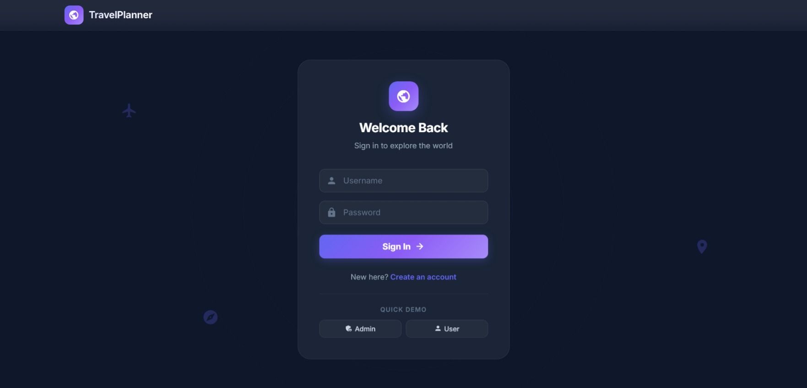
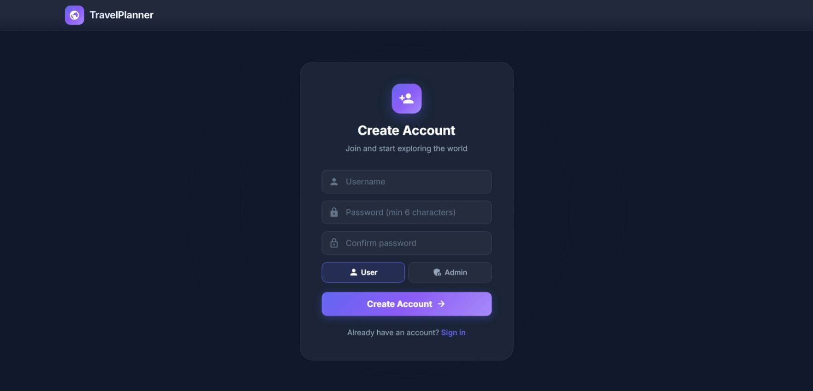
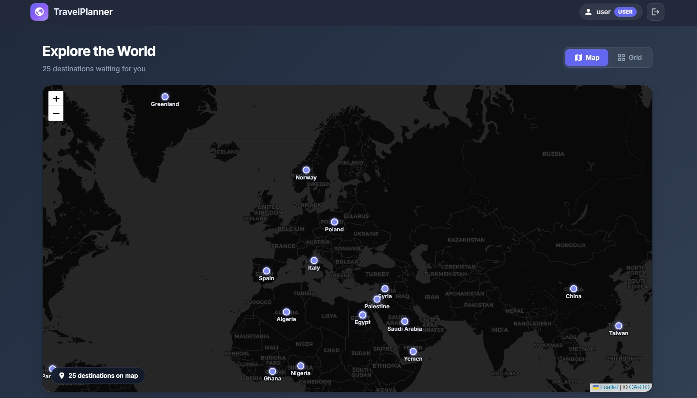
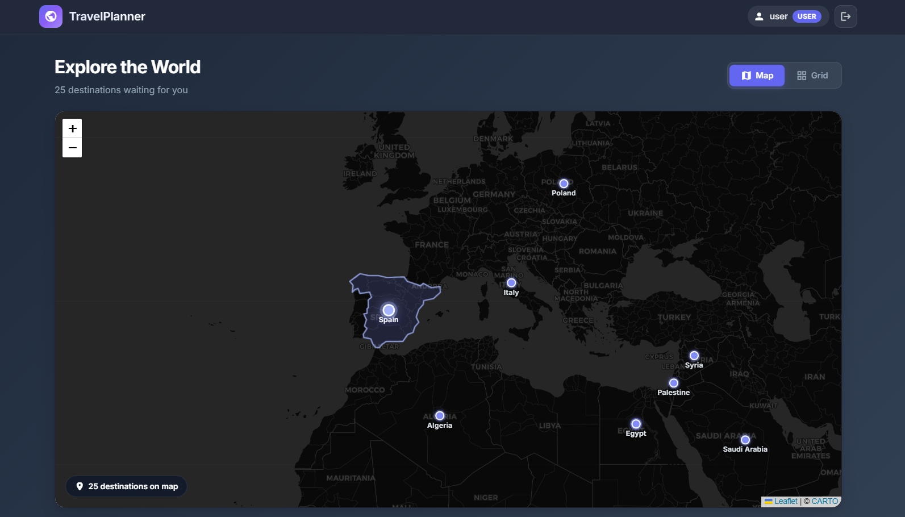
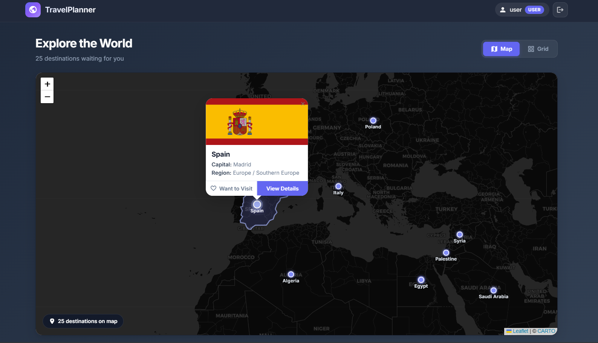
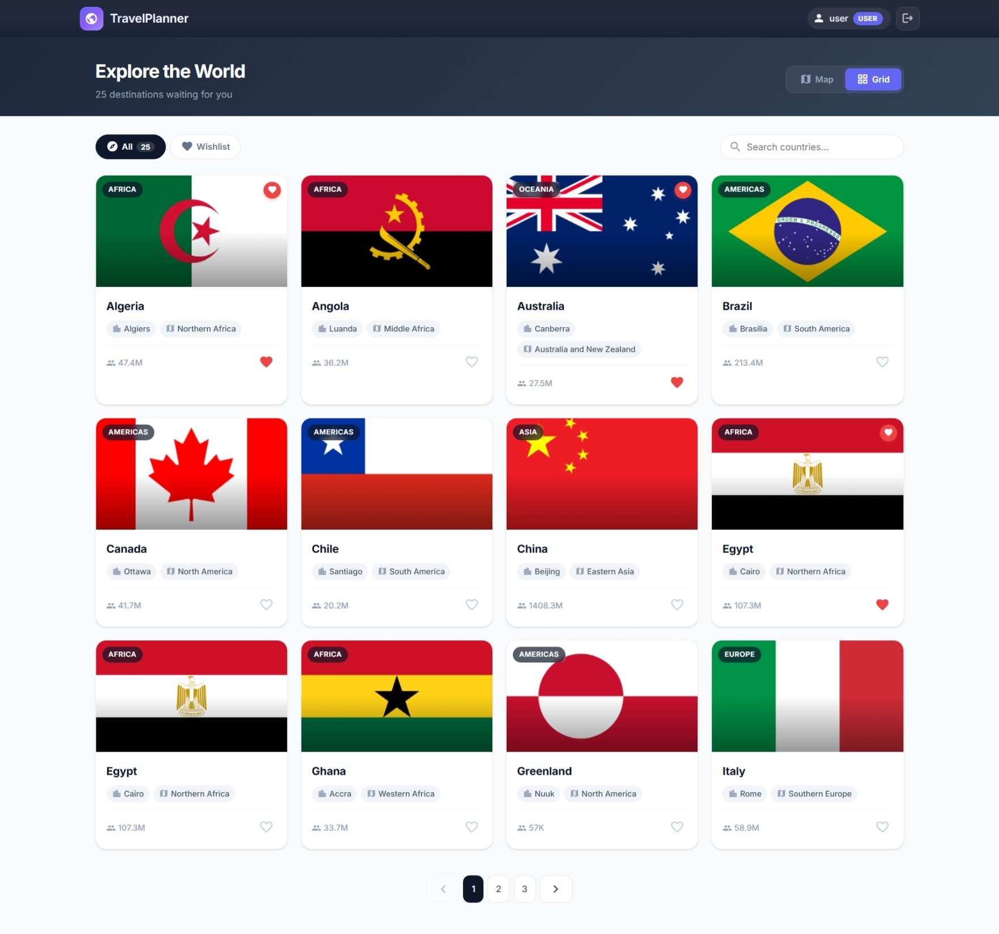
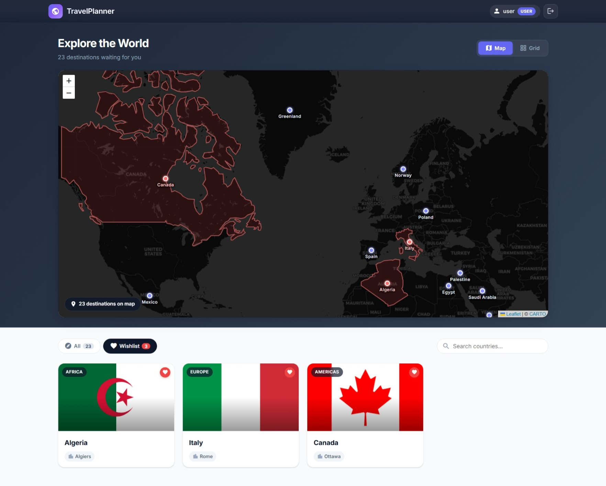
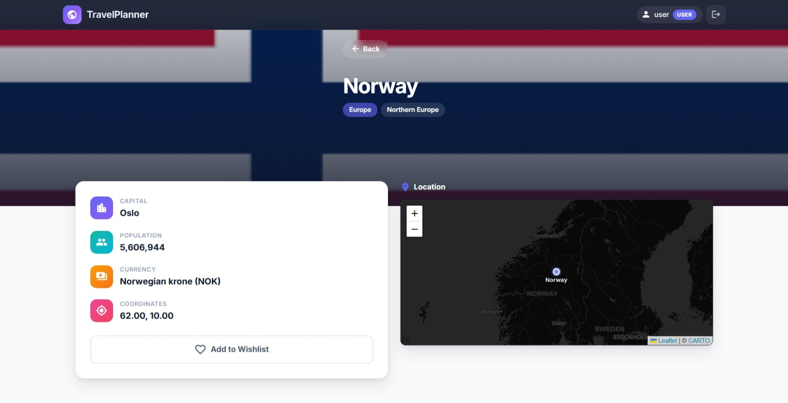
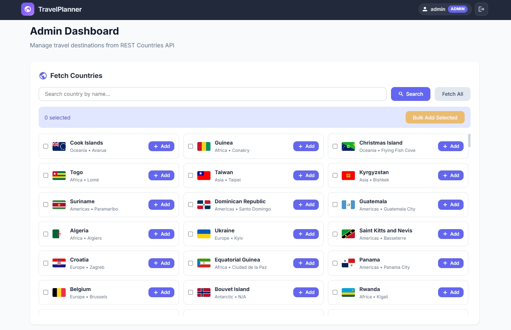
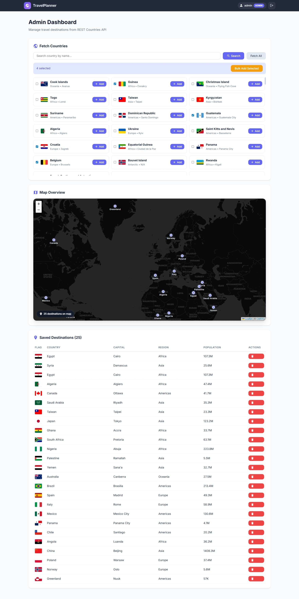

# Travel Destination Planner

A full-stack travel destination planner application built with **Angular**, **Spring Boot**, and **PostgreSQL**. Browse, search, and bookmark travel destinations sourced from the REST Countries API, visualized on an interactive world map.

# Quick Start (Docker)
### Prerequisites

- Docker & Docker Compose installed

### Run


```bash
git clone https://github.com/abmoez/travel-planner.git
cd travel-planner/
docker compose up --build
```

| Service  | URL                     |
|----------|-------------------------|
| Frontend | http://localhost        |
| Backend  | http://localhost:8080   |
| Postgres | localhost:5432          |

### Default Credentials

| Role  | Username | Password  |
|-------|----------|-----------|
| Admin | admin    | admin123  |
| User  | user     | user123   |


## Tech Stack

| Layer    | Technology                    |
|----------|-------------------------------|
| Frontend | Angular 19, TypeScript, Leaflet |
| Backend  | Spring Boot 3.4, Java 21     |
| Database | PostgreSQL 16                 |

## Screenshots

### Login Page

Animated login screen with quick-access demo credentials and a link to sign up.



### Sign Up Page

New user registration with role selection (User / Admin).



### User Dashboard — Map View

Interactive dark-themed world map with labeled pins for each destination. Hover over a pin to highlight the country's borders on the map. Click a pin to see the country flag, capital, region, and a "Want to Visit" button in a popup.



### User Dashboard — Country Hover Highlight

Hovering over a destination pin highlights the country's geographic boundaries with a translucent overlay, giving a clear visual indication of which country you're interacting with.





### User Dashboard — List View

Card-based grid of destinations with flags, region tags, and quick info. Supports search and pagination.



### User Dashboard — Wishlist View

Card-based grid of wishlisted destinations with flags, region tags, and quick info. Supports a click to destination full page. Wishlisted Destinations get real-time highlighted in red on map.



### Destination Detail

Full destination detail page with a flag hero banner, stats panel (capital, population, currency, coordinates), wishlist toggle, and an embedded mini-map.



### Admin Dashboard — Country Management

Admin panel for managing destinations — search or fetch all countries from the REST Countries API with inline loading indicators, then add individually or in bulk. Remove existing destinations from the catalog.



### Admin Dashboard — Map Overview

Live map of all saved destinations with labeled pins. Hover over a pin to highlight the country's borders. The map updates automatically as destinations are added or removed.



## Features

### Data Seeding (Auto-populated Destinations)

On first startup, the `DataSeeder` component automatically populates the database so user-facing features can be tested immediately without any admin setup:

1. **Demo accounts** are created — `admin/admin123` (ADMIN) and `user/user123` (USER).
2. **Destinations are seeded** from `seed-destinations.json`, a JSON file containing pre-fetched country data from the REST Countries API.

This means a USER can log in and immediately browse destinations on the map, view details, and toggle "Want to Visit" — no admin intervention required.

#### Controlling Destination Seeding

Destination seeding is controlled by the `seed.destinations.pre-populate` property in `application.properties`:

```properties
# Set to true to seed destinations on startup, false to skip
seed.destinations.pre-populate=true
```
Set this to `false` if you want to start with an empty catalog and add destinations manually through the admin dashboard.

### Blocked Destinations

Blocking destinations is available by the `app.blocked-countries` property in `application.properties`:

```properties
# Add blocked destinations
app.blocked-countries=add,here,any,countries,to,be,blocked
```

## External API

Uses [REST Countries API](https://restcountries.com/) with field filtering:

```
GET https://restcountries.com/v3.1/all?fields=name,capital,region,subregion,population,currencies,flags,latlng
GET https://restcountries.com/v3.1/name/{name}?fields=name,capital,region,subregion,population,currencies,flags,latlng
```
